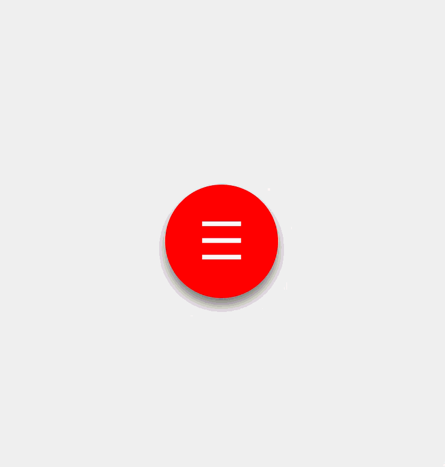

# Pentagon Menu Using HTML, CSS, and JavaScript

This project creates a **Pentagon-shaped expandable navigation menu** using only HTML, CSS, and a small bit of JavaScript.  
When clicked, the central button expands into a Pentagon layout with navigation icons arranged around it.

---

## 🚀 Demo

When the central menu button (`≡`) is clicked:
- It changes to a close button (`×`)
- Five navigation icons animate into a Pentagon layout around the button
- Clicking again collapses the menu

---

## 📂 Project Structure

├── index.html # Main HTML structure

├── style.css # All styling and Pentagon layout animations

└── main.js # JavaScript to toggle menu open/close

---

## 🛠 Technologies Used

- **HTML5** — structure
- **CSS3** — styling, animations, transitions
- **JavaScript** — menu toggle functionality

---

## 📜 How It Works

1. **HTML (`index.html`)**

   - Contains the central menu button and 5 navigation links aligned in the markup.

3. **CSS (`style.css`)**

   - Uses **CSS variables** for easy customization

   - `transform` and `transition` handle the smooth expansion/rotation

   - Positions navigation icons in a Pentagon pattern using **`:nth-child()` selectors**

   - Animations trigger by toggling the `.open_menu` class

4. **JavaScript (`main.js`)**
   - Listens for a click on the `.menu` element
   - Toggles `.open_menu` to open/close the Pentagon

---

## 🖼 Features

✅ Smooth transition and rotation effects  

✅ Responsive layout using `calc()` and CSS variables  

✅ Minimal JavaScript — purely for toggling class  

✅ Customizable colors and button size  

---

## 🎯 How to Run

1. Clone the repository:

git clone https://github.com/your-username/pentagon-menu.git

2. Open `index.html` in your browser.

That’s it — no build process, no dependencies.  

---

## ⚙ Customization

You can easily tweak:

- **Button size** → change `--btn-size` in `body`

- **Accent color** → change `--accent-color` in `body`

- **Speed of animation** → adjust `transition` timing in `.menu` and `.nav-item`

---

## 📌 Example Preview

**Closed Menu**

**Open Menu (Pentagon Layout)**  
